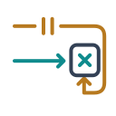

# StaleFill

[](go.mod)
[](docs/architecture.md#protocol-and-connection-limits)
[](LICENSE)

StaleFill deterministically tests cache-aside race conditions by controlling Redis/Valkey command ordering.

It can hold an old cache fill, allow a newer authoritative write and invalidation to finish, then release the old fill and check whether stale data becomes visible again.

```text
Application  →  StaleFill RESP proxy  →  Redis / Valkey
                       ↑
               HTTP probe runner
```

An ordinary Redis client needs only its Redis address changed to the proxy address. StaleFill checks specific modeled schedules. It does not prove complete cache consistency.

## What StaleFill checks

A reader misses the cache and reads authoritative version V1. Before its old fill reaches Redis, a writer stores V2 and invalidates the key. The delayed fill can then put V1 back into the cache. StaleFill forces this ordering and checks the final cache-backed HTTP response.

```text
Reader: cache miss → read V1 → cache fill held
Writer: write V2 → invalidate cache → HTTP write completes
        independent authoritative endpoint confirms V2
Reader: old fill released → read completes
Verify: cache-backed HTTP read returns V1 (FAIL) or V2 (PASS)
```

Supported fills include GET/MGET with SET/SETEX/PSETEX, hash reads with HSET, and single-key hash transactions held at EXEC. Negative-cache scenarios check whether an old “missing” result survives creation of the record. See [architecture and supported behavior](docs/architecture.md) for exact command patterns and protocol limits.

## Using a binary archive

Extract the archive for your operating system and architecture. Archives contain the CLI, examples and documentation; Go is needed only for source builds. On Windows, use `stalefill.exe`.

```sh
./stalefill init
# Edit stalefill.json for your application's endpoints and cache key.
./stalefill doctor --config stalefill.json
./stalefill test --config stalefill.json --report stalefill-repro.json
```

Configure your application's Redis client to use the proxy address. Both commands execute the configured application writes, so use a disposable integration environment. Follow the [configuration guide](docs/configuration.md) when connecting your application. Verify downloaded archives against their `SHA256SUMS` file.

## Quick start from source

Requires Go 1.26 or newer, plus a disposable Redis or Valkey instance. No third-party Go dependencies.

```sh
go build -o bin/stalefill ./cmd/stalefill
go build -o bin/stalefill-demo ./cmd/demo
./bin/stalefill init
```

Start a disposable Redis (or use your existing local test instance):

```sh
docker run --rm --name stalefill-demo-redis \
  -p 127.0.0.1:6379:6379 redis:8.10.2-alpine \
  redis-server --save '' --appendonly no
```

In another terminal, start the broken application:

```sh
./bin/stalefill-demo --mode broken --redis 127.0.0.1:6380
```

In a third terminal:

```sh
./bin/stalefill doctor --config stalefill.json
./bin/stalefill test --config stalefill.json --report broken.json
# Exits 1: FAIL SF001: stale cache resurrection
```

Stop the application and restart it with `--mode fixed`. Repeat the same `test` command with `--report fixed.json`: it exits 0, PASS. `prepare` resets the fixture before every schedule, so repeated runs need no manual Redis cleanup.

The application must accept HTTP requests without requiring Redis during startup, or retry its initial Redis connection. The proxy listener exists only during `doctor` and `test`; no background daemon is installed.

## Documentation

- [Configuration](docs/configuration.md): connect an application, select a key and define HTTP observations.
- [Commands and results](docs/results.md): CLI options, exit codes, findings and diagnostic traces.
- [Architecture and supported behavior](docs/architecture.md): scheduling, transaction handling, protocol support and limits.
- [Client compatibility](docs/client-compatibility.md): tested Redis clients and reproducible validation.
- [gocache case study](docs/cases/gocache-v4.4.0.md): external validation of asynchronous fills with unchanged v0.2.0.
- [Tool comparison](docs/comparison.md): how controlled command ordering differs from other testing approaches.
- [Contributing](CONTRIBUTING.md): source setup, checks and release packaging.
- [Changelog](CHANGELOG.md): versioned changes.

Licensed under [Apache-2.0](LICENSE).
